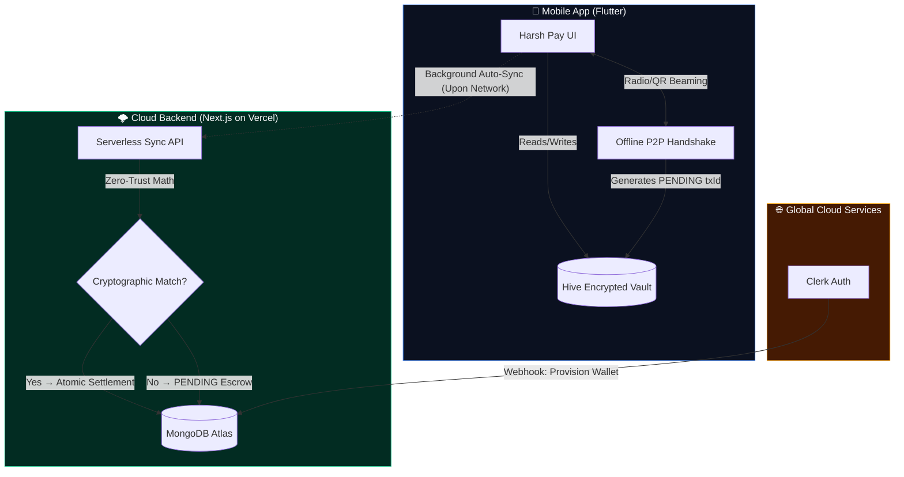

<div align="center">
  
  
  <br/>
  <h1>💳 Harsh Pay</h1>
  <p><strong>An End-to-End Offline-First, Zero-Trust Digital Payment Ecosystem</strong></p>

  <p>
    <a href="https://flutter.dev"></a>
    <a href="https://nextjs.org"></a>
    <a href="https://www.mongodb.com"></a>
    <a href="https://dart.dev"></a>
    <a href="https://harsh-bank.vercel.app"></a>
  </p>
  <p>
    
    
    
  </p>
</div>

<br/>

> **Harsh Pay** bridges the critical gap between digital convenience and physical cash reliability. Transact in deep subways, remote wilderness, or during network outages using our **Zero-Trust Two-Way Escrow Architecture**.

<br/>

## 🌐 Live Environments
| Resource | Link |
| :--- | :--- |
| **📱 App Download (APK)** | [Download Latest Release](https://github.com/Harshkumar2306/Harsh-Pay-App/releases) |
| **💻 Web Dashboard** | [https://harsh-bank.vercel.app](https://harsh-bank.vercel.app) |
| **⚙️ Backend API** | `https://harsh-bank.vercel.app/api` |
| **📁 Source Code** | [GitHub Repository](https://github.com/Harshkumar2306/Harsh-Pay-App) |

---

## ✨ Key Features

### 📴 True Offline Payments (Radio & Optical)
Transfer funds without a single byte of internet. 
- **Radio Transfers**: Harnesses Google's `nearby_connections` (Wi-Fi Direct & BLE) to broadcast and discover devices dynamically.
- **Optical Transfers**: ML-powered `mobile_scanner` facilitates lightning-fast, hardware-agnostic QR code handshakes.

### 🔐 Zero-Trust Escrow Settlement Engine
Traditional offline apps use "Optimistic" UI, which leads to rampant double-spending fraud. Harsh Pay inherently distrusts both the sender and receiver.
- Transactions are logged locally as `PENDING` cryptographic envelopes (`UUID::ReceiverID::SenderID`).
- Both devices must independently upload their cryptographic envelopes when they regain internet.
- **Match-and-Settle Math**: Only if Amount, Sender, and Receiver identically match within a 24-hour TTL does the backend atomically settle the transaction in MongoDB.

### 📡 Intelligent Background Polling
A resilient live-update engine built entirely in Dart.
- **Network Awareness**: Detects transition from Airplane Mode to Wi-Fi instantly.
- **Debounced Routing**: Waits exactly 2 seconds for DNS/Routing to establish before flooding the network.
- **Silent Escrow Engine**: Periodically pings the cloud every 3 seconds to silently upload offline payloads and fetch live balance changes.

### 🎨 Ultra-Premium Glassmorphic UI
Built with a dark-mode-first aesthetic that focuses on user feedback.
- Fluid micro-animations and granular Haptic Feedbacks.
- Live-updating balance cards that glow **Emerald Green** when online and **Amber** when operating via the offline Hive vault.
- Native Android 13+ and iOS Push Notifications integrated via `flutter_local_notifications`.

---

## 🏗️ System Architecture

Harsh Pay operates on a tripartite architecture designed for extreme fault tolerance.



---

## 🛠️ Local Setup & Testing

### Prerequisites
* **Flutter SDK** (`^3.12.2`)
* **Node.js** (`18+`)
* Two physical smartphones for testing Radio features (Emulators lack Bluetooth/Wi-Fi Direct hardware).

### 1. Pair Your Device (The Zero-Trust Handshake)
1. Navigate to the [Web Dashboard](https://harsh-bank.vercel.app) and Sign Up via Clerk.
2. Go to **Security Profile** and click to reveal your **App Sync ID QR Code**.
3. Open the Harsh Pay mobile app, tap **"I have an account"**, and scan the QR code.
4. Your Hive database is now provisioned securely via an encrypted payload!

### 2. Run the Mobile App
```bash
git clone https://github.com/Harshkumar2306/Harsh-Pay-App.git
cd Harsh-Pay-App/harsh_pay
flutter pub get
flutter run
```
> **Note for iOS users:** Radio Transfer requires Google's Nearby Connections SDK, which currently lacks full iOS platform channel support. iOS devices will gracefully degrade and instruct users to use the QR scanner for offline mode.

### 3. Run the Backend (Next.js)
```bash
cd Harsh-Pay-App/harsh_bank_web
npm install
# Configure .env with your MONGODB_URI and CLERK keys
npm run dev
```

---

## 🧪 Core API Endpoints

| Method | Endpoint | Description |
| :--- | :--- | :--- |
| `POST` | `/api/sync/wallet` | Securely fetches the user's latest verified cloud balance and transaction history. |
| `POST` | `/api/sync/transactions` | **The Escrow Engine**. Receives offline cryptographic envelopes, matches them against counterparties, and atomically settles in MongoDB. |
| `POST` | `/api/pay/online` | Real-time UPI-style payments. Debits sender and credits receiver instantly using ACID transactions. |

---

## ⚖️ Evaluation & Quality Criteria

| Engineering Pillar | Execution Strategy |
| :--- | :--- |
| **Distributed Systems Logic** | Overcame the classic "Offline Double Spend" problem by inventing a mathematical Match-and-Settle Zero-Trust Escrow. |
| **Hardware & Firmware Mastery** | Direct C++ binding invocations to Google's Nearby APIs for hardware-level Bluetooth & Wi-Fi LAN manipulation. |
| **UX & Polish** | Pixel-perfect glassmorphism, real-time connectivity listeners, native alerts, and state-driven radar animations. |
| **Cloud-Native Deployment** | Scalable Vercel edge-functions tied directly to highly-available MongoDB Atlas clusters. |

---

<div align="center">
  <i>Built with ❤️ for a world without internet limits.</i>
</div>
