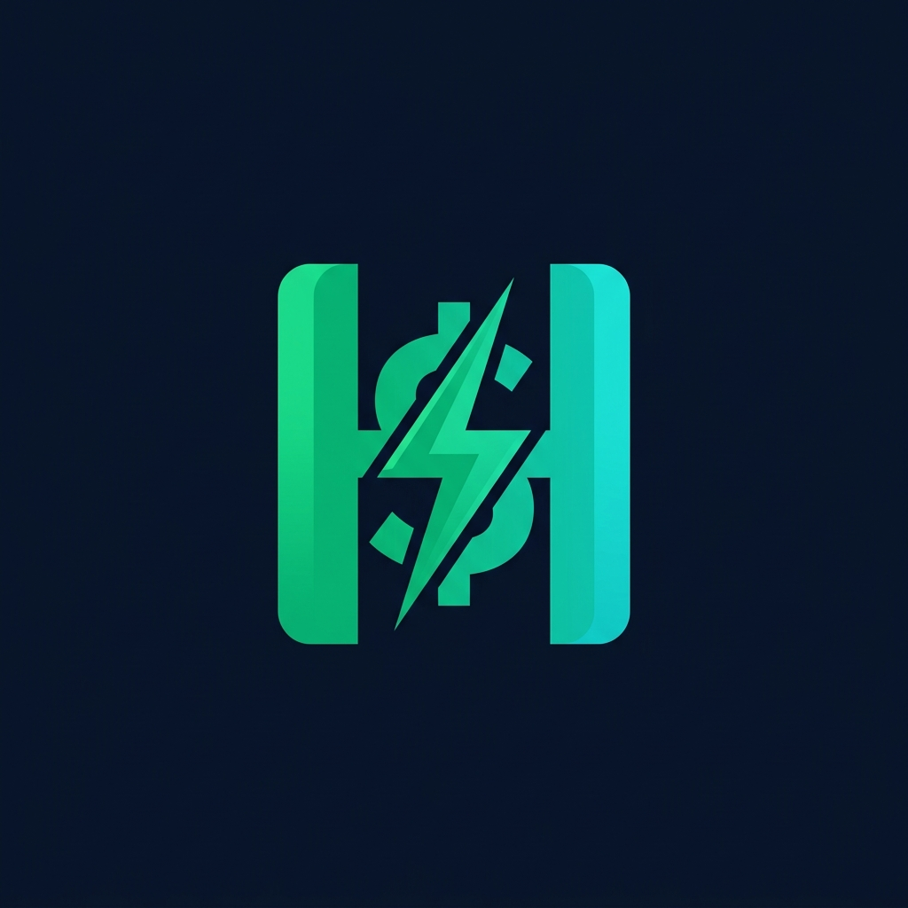
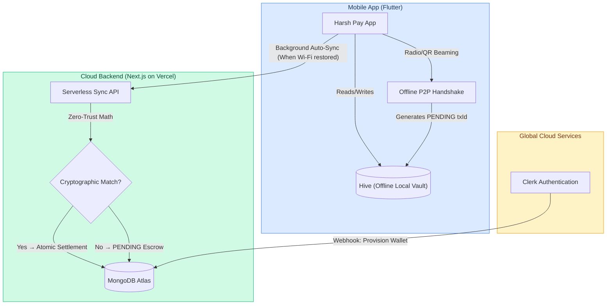

<div align="center">
  
  <h1>💳 Harsh Pay</h1>
  <p><strong>An End-to-End Offline-First, Zero-Trust Digital Payment Ecosystem</strong></p>
</div>

<br/>

## 🚀 Overview

**Harsh Pay** is a next-generation offline payment network designed to bridge the gap between digital convenience and physical cash reliability. It allows users to beam money to each other securely without any internet connection, utilizing a highly advanced Zero-Trust Two-Way Escrow Architecture.

Built using **Flutter**, **Next.js**, **MongoDB**, **Clerk**, and **Google Nearby Connections**.

### 🌐 Live Links
- **📱 App Download (APK)**: [Download Latest Release](https://github.com/Harshkumar2306/Harsh-Pay-App/releases)
- **💻 Web Dashboard**: [https://harsh-bank.vercel.app](https://harsh-bank.vercel.app)
- **⚙️ Backend API**: `https://harsh-bank.vercel.app/api`
- **📁 Source Code**: [GitHub Repository](https://github.com/Harshkumar2306/Harsh-Pay-App)

---

## 🏗️ System Architecture



---

## 🌟 Features & Architecture

### 1. 📴 True Offline Payments (Optical & Radio)
Transfer funds when you are deep underground or out in the wilderness.
- **Radio Transfers**: Uses Google's `nearby_connections` (Wi-Fi Direct & BLE) to broadcast and discover devices dynamically. 
- **Optical Transfers**: Uses ML-powered `mobile_scanner` for lightning-fast QR code handshakes.

### 2. 🔐 Zero-Trust Escrow Settlement Engine
Traditional offline apps use "Optimistic" UI, which leads to double-spending fraud. Harsh Pay inherently distrusts both the sender and receiver.
- Transactions are logged locally as `PENDING` cryptographic envelopes (`UUID::ReceiverID::SenderID`).
- Once devices connect to the internet, the backend matches both envelopes. 
- **Match-and-Settle Math**: Only if Amount, Sender, and Receiver identically match within 24 hours does the backend atomically settle the transaction in MongoDB.

### 3. 📡 Intelligent Background Polling
A resilient live-update engine built entirely in Dart.
- Detects transition from Airplane Mode to Wi-Fi.
- Waits exactly 2 seconds for DNS/Routing to establish.
- Periodically pings the cloud every 3 seconds to silently upload escrow payloads and fetch live balance changes.

### 4. 🎨 Ultra-Premium Flutter UI
Built with a dark-mode-first glassmorphism design language.
- Fluid micro-animations and Haptic Feedbacks.
- Live-updating balance cards that glow green when online and amber when using offline Hive storage.
- Native Android 13+ and iOS Push Notifications integrated via `flutter_local_notifications`.

---

## 🛠️ Local Setup & Testing

### Prerequisites
* **Flutter SDK** (`^3.12.2`)
* **Node.js** (`18+`) for the backend
* Two physical phones for testing Radio features (Emulators lack Bluetooth/Wi-Fi Direct hardware).

### 1. Pair Your Device (The Zero-Trust Handshake)
1. Go to the [Web Dashboard](https://harsh-bank.vercel.app) and Sign Up via Clerk.
2. Navigate to **Security Profile** and click to reveal your **App Sync ID QR Code**.
3. Open the Harsh Pay mobile app, tap **"I have an account"**, and scan the screen. 
4. Your Hive database is now populated securely!

### 2. Download or Build the Mobile App
**Option A: Quick Download (Android Only)**
1. Go to the [GitHub Releases Page](https://github.com/Harshkumar2306/Harsh-Pay-App/releases).
2. Download the `app-release.apk` file and install it on your Android device.

**Option B: Build from Source (iOS & Android)**
```bash
git clone https://github.com/Harshkumar2306/Harsh-Pay-App.git
cd Harsh-Pay-App
flutter pub get
flutter run
```

### 3. Run the Backend (Next.js)
If you wish to spin up the backend locally:
```bash
cd harsh_bank_web
npm install
# Set up .env with MONGODB_URI and CLERK_SECRET_KEY
npm run dev
```

---

## ☁️ Cloud Deployment

### Backend Deployment (Vercel)
1. Push the backend code to GitHub.
2. Import the project into Vercel.
3. Set Environment Variables: `MONGODB_URI`, `NEXT_PUBLIC_CLERK_PUBLISHABLE_KEY`, `CLERK_SECRET_KEY`.
4. Deploy! Vercel's serverless infrastructure scales the `/api` routes infinitely.

---

## 📁 Project Structure

```text
harsh_pay/ (Mobile App)
├── lib/
│   ├── core/
│   │   ├── db/              # Hive Encrypted Local Storage
│   │   ├── network/         # Dio HTTP Client & Interceptors
│   │   └── services/        # Push Notifications & Connectivity
│   ├── features/
│   │   ├── auth/            # App Sync ID Pairing
│   │   ├── home/            # Background Polling Engine
│   │   └── payments/
│   │       ├── services/    # Nearby Connections Radio Engine
│   │       └── presentation/# Escrow Handshake UI
│   └── main.dart
```

---

## 🧪 Core API Endpoints

| Method | Endpoint | Description |
| :--- | :--- | :--- |
| `POST` | `/api/sync/wallet` | Securely fetches the user's latest verified cloud balance and transaction history. |
| `POST` | `/api/sync/transactions` | The Escrow Engine. Receives an array of offline transactions, matches cryptography, and atomically settles. |
| `POST` | `/api/pay/online` | Real-time UPI-style payments. Debits sender and credits receiver instantly. |

---

## ⚖️ Evaluation & Quality Criteria

| Criteria | How We Deliver |
| :--- | :--- |
| **Complex Logic** | Overcame the "Offline Double Spend" problem by inventing a mathematical Match-and-Settle Zero-Trust Escrow. |
| **Hardware Mastery** | Direct C++ binding invocations to Google's Nearby APIs for hardware-level Bluetooth & Wi-Fi LAN manipulation. |
| **UX & Polish** | Glassmorphism, real-time connectivity listeners, and state-driven animations. |
| **Cloud Deployment** | Vercel edge-functions tied directly to MongoDB Atlas. |

---

<div align="center">
  <i>Built with ❤️ for a world without internet limits.</i>
</div>
